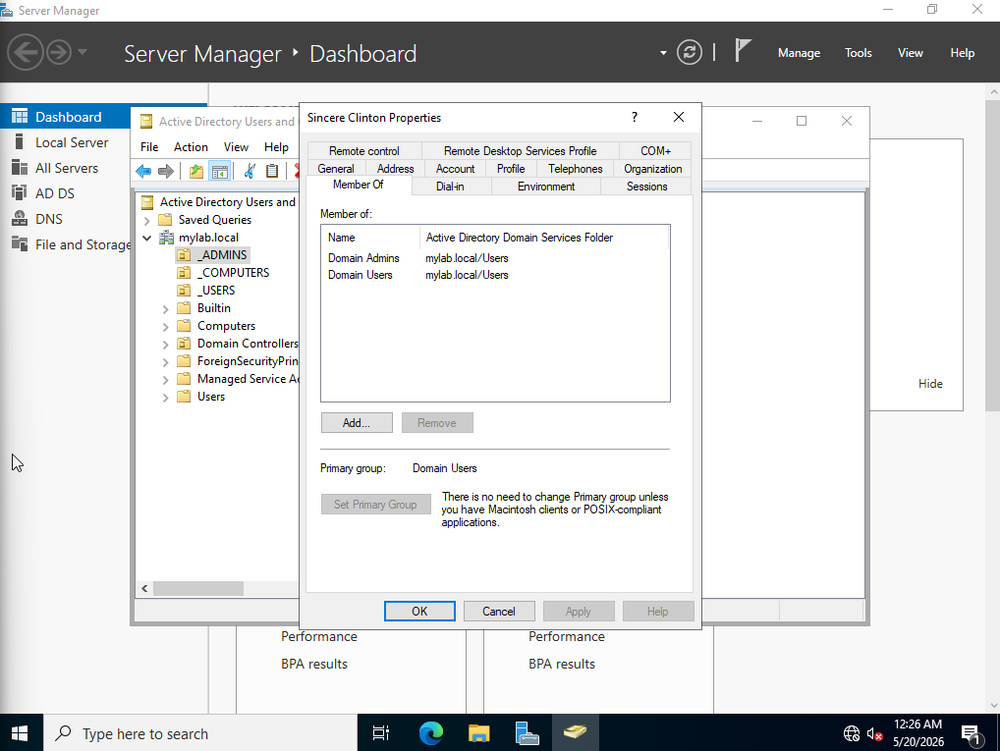
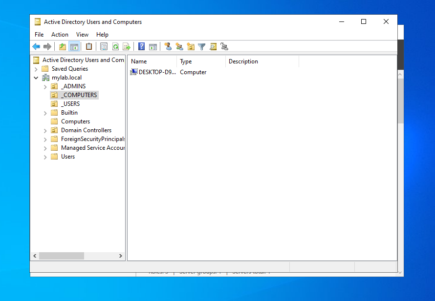

# Active Directory Homelab

## Overview
Built a fully functional Active Directory environment from scratch using 
VirtualBox. Configured a Windows Server 2019 Domain Controller, joined 
Windows client machines to the domain, and implemented Group Policy, 
user management, and network segmentation through pfSense.

## Environment
- Host OS: Windows 11
- Hypervisor: VirtualBox
- Domain Controller: Windows Server 2019 Evaluation
- Client Machine: Windows 10/11
- Firewall/Router: pfSense
- Domain Name: mylab.local

## What I Built
- Installed and configured Windows Server 2019 as a Domain Controller
- Promoted server to DC and created a new AD forest
- Configured DNS integrated with Active Directory
- Created Organizational Units (OUs) for structured user management
- Created and managed multiple user accounts
- Configured Group Policy Objects (GPOs) for security settings
- Joined Windows client machines to the domain
- Configured pfSense as firewall and DHCP server for LAN segmentation
- Tested account lockout, password reset, enable/disable workflows

## Active Directory Tasks Performed
| Task | Description |
|------|-------------|
| User creation | Created multiple domain user accounts |
| Account disable/enable | Disabled and re-enabled user accounts |
| Password reset | Reset passwords and forced change at next login |
| Account lockout | Triggered and resolved account lockouts |
| OU structure | Organized users into logical Organizational Units |
| GPO configuration | Applied Group Policy for password complexity and lockout policy |
| Domain join | Connected Windows client machines to the domain |
| Security groups | Created and managed security groups |

## Network Architecture
- pfSense VM: LAN gateway at 192.168.1.1
- Domain Controller: 192.168.1.101 (static)
- Client machines: DHCP assigned via pfSense
- Splunk SIEM: 192.168.1.50 (receiving AD logs)

## Screenshots
[Screenshots to be added]

## Skills Demonstrated
- Active Directory administration
- Windows Server 2019 configuration
- Group Policy management
- DNS configuration
- Network segmentation with pfSense
- Domain user and group management
- Security policy implementation

- ## Screenshots

### AD DS and DNS Roles Installed

### Organizational Unit Structure

### Admin Account Domain Admins Membership

### Password Policy GPO

### Account Lockout GPO

### Desktop Prevention GPO Enabled

### Security Baseline Policy at Domain Level

### User Security Policy Under _USERS OU

### Security Group Creation (IT Staff)
.png)

### whoami — Domain User Verified
.png)

### Desktop GPO Active and Enforced

### gpresult — User Security GPO Applied

### Password Reset Evidence

### Account Disabled Evidence

### Account Enabled Evidence

### Account Investigation Script

### Account Lockout Evidence

### Account Lockout Troubleshot and Resolved

### _COMPUTERS OU — Client Machine Moved

